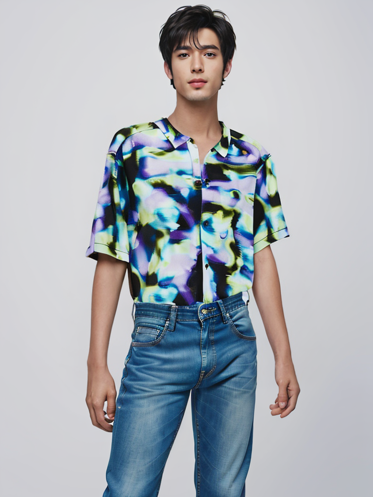

# OOTD VTON

## Description

OOTD VTON is a virtual try-on application that allows users to experiment with outfits virtually. By leveraging state-of-the-art techniques like Diffusion, Inpainting, and various pre-trained models, the app enables users to paste outfit links from platforms like Myntra and try on different clothing items. The application supports image upscaling and image expansion.

The following models and techniques have been integrated:
- **OOTD Diffusion** (via [OOTDiffusion](https://huggingface.co/spaces/levihsu/OOTDiffusion))
- **IDM VTON** (via [IDM-VTON](https://huggingface.co/spaces/yisol/IDM-VTON/tree/main))
- **IPAdapter** (via [IP-Adapter](https://github.com/tencent-ailab/IP-Adapter/tree/main))
- **Image Upscaling** with [Real-ESRGAN](https://github.com/xinntao/Real-ESRGAN)
- **Image Expansion** using [Outpainting Differential Diffusion](https://huggingface.co/blog/OzzyGT/outpainting-differential-diffusion)

The application extracts upper clothing from user-selected images using **Segformer** and passes the results to the `process_hd` function for processing.

Additionally, upscaling and expansion functionality is executed on Google Colab and exposed locally using Ngrok.

## Features

- Virtual try-on using real-world outfits from links (e.g., Myntra)
- Automatic upper-clothing extraction with Segformer
- Image upscaling using Real-ESRGAN
- Image expansion using Differential Diffusion Outpainting
- Processing models locally via Flask
- Integration with google collab using Ngrok for remote execution

## Getting Started

### Installation

1. Clone the repository:
   ```bash
   git clone https://github.com/yourusername/ootd_vton.git
   ```

2. Navigate to the project directory:
   ```
   cd ootd_vton
   ```
3. Download checkpoints from [Checkpoints OOTDiffusion](https://huggingface.co/spaces/levihsu/OOTDiffusion/tree/main/checkpoints)
    
4. Google Colab Setup (for upscaling and expansion)
    ```Set up the Colab notebook for upscaling using Real-ESRGAN or image expansion.
    Expose the Colab instance using Ngrok to connect it to your local application.
    ```

5. Run the application:
   ```
   python app.py
   ```

## Usage

1. Paste an outfit link (e.g., from Myntra) into the app.
2. The upper clothing will be extracted using the `segment_cloth.py` file, and the image will be passed to the `process_hd` function for virtual try-on.
3. For image upscaling or expansion, the app communicates with the exposed Colab instance via Ngrok to process and return the results.
4. Result images can be found in the `static` directory for reference.

## To Do

- Train LoRA using SDXL or FLUX for enhanced model fine-tuning.
- Integrate **ControlNet** or **Charturner** to generate different poses for the same outfit.
- Enhance segmentation for more accurate clothing extraction.
- Add support for various body types and poses.


## Sample Output

More results can be found in debug_sample folder


## Acknowledgments

Special thanks to the developers of:

- [OOTDiffusion](https://huggingface.co/spaces/levihsu/OOTDiffusion)
- [IDM-VTON](https://huggingface.co/spaces/yisol/IDM-VTON/tree/main)
- [IP-Adapter](https://github.com/tencent-ailab/IP-Adapter/tree/main)
- [Real-ESRGAN](https://github.com/xinntao/Real-ESRGAN)
- [Outpainting Differential Diffusion](https://huggingface.co/blog/OzzyGT/outpainting-differential-diffusion)

## Contact

For any queries or suggestions, please open an issue on this GitHub repository


## App Demonstration


